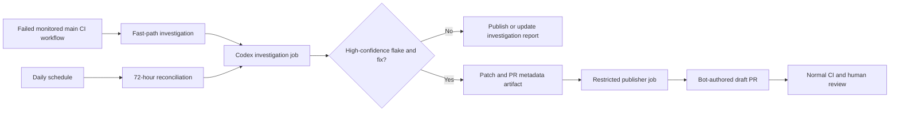

# Codex CI Flake Automation Plan

Last updated: 2026-07-24

Status: Phase 1 report-only implementation prepared for review

The initial implementation is under `.github/ci-flake/` with its entry point at
`.github/workflows/ci-flake-investigator.yml`. It includes the daily and manual
reconciliation triggers, bounded evidence collection, a network-disabled Codex
investigator, validated summaries, last-30 outcome statistics, and manual fix
handoffs. It does not include the failed-main fast path or any PR publisher.

## Purpose

Build an automated investigator for Temporal SDK repositories that:

1. Searches recent CI runs for credible flakes.
2. Groups repeated failures by a stable signature.
3. Determines when and why a flake started.
4. Produces a minimal, evidence-backed fix.
5. Opens a draft pull request only when the diagnosis and fix are high confidence.
6. Leaves a useful investigation report when the evidence is insufficient.

The automation must favor correctness and auditability over PR volume. A run
that finds nothing or declines to open a PR is a successful run.

## Recommended Decision

Start with a complete scheduled GitHub Actions workflow committed directly to
`sdk-go`, with Codex as the investigator and, after the report-only workflow is
proven, an organization-owned GitHub App as the production publisher.

- Begin with a daily rolling 72-hour reconciliation run.
- After the daily workflow is reliable, also trigger a fast-path investigation
  when a monitored main CI workflow completes with a failure.
- Keep the daily run permanently as the reconciliation and recovery path.
- Keep every new CI-flake automation file under `.github/`.
- Keep the investigator instructions in an explicitly loaded repo-local
  runbook rather than adding a root `.agents/` directory solely for this
  workflow.
- Publish a concise AI findings summary on the GitHub Actions run summary page
  for every investigation, including runs that find no credible flake.
- In report-only mode, provide an actionable manual fix handoff whenever the
  evidence supports a specific fix so a developer can create the PR.
- Keep workflow success and failure reserved for automation health. Show
  whether a run opened a PR as a separate, prominent investigation outcome.
- Keep the investigation job read-only with respect to GitHub.
- Pass changes to a separate publisher job as a patch artifact.
- Let the publisher job use a short-lived GitHub App installation token.
- Attribute PRs and commits to a dedicated bot such as
  `temporal-ci-flake-bot[bot]`.
- Open draft PRs only. Never approve, merge, or bypass branch protection.
- Prove the workflow in report-only mode and then draft-PR mode before copying
  it to another SDK.
- Treat synchronization, a public reusable workflow, or a private central
  orchestrator as later consolidation options rather than pilot prerequisites.



## Trigger Strategy: Fast Path Plus Daily Reconciliation

Use both triggers in steady state, but introduce them in phases. Start with the
daily trigger because it is easier to evaluate investigation quality, cost, and
deduplication without reacting to every ordinary regression. Add the
event-driven trigger only after daily reports and draft PR decisions are
consistently trustworthy.

Both triggers use the same investigation runbook, evidence standards, normalized
signature, PR eligibility gate, and publisher boundary.

### Fast Path: Failed Main CI Workflow

Trigger once after a monitored main CI workflow completes with a failed
conclusion.

Requirements:

- Use a completed workflow event such as `workflow_run`.
- Monitor an explicit allowlist of main CI workflows.
- Require `conclusion == failure`.
- Require the head branch to be `main`.
- Require the head repository to be the SDK repository itself.
- Trigger once per failed workflow run, not once per failed matrix job.
- Collect all failed jobs from the completed workflow before classification.
- Exclude the CI flake investigator workflow itself.
- Pass the source workflow run ID and an execution mode such as
  `main-failure-fast-path` to the shared investigation logic.
- Compare the failure with historical runs before classifying it as flaky.
- Treat a single unexplained main failure as report-worthy, but normally
  insufficient by itself for an automated fix PR.

The fast path reduces time to triage. It must not run code or consume artifacts
from an untrusted ref while a publisher credential is available.

### Reconciliation Path: Daily 72-Hour Sweep

A daily schedule catches regressions quickly. A 72-hour lookback gives sparse
flakes more than one opportunity to appear and protects against delayed or
missed runs.

The daily run:

- Inspects both main and pull-request CI.
- Clusters occurrences across workflows, commits, platforms, and modes.
- Revisits fast-path reports that initially lacked enough evidence.
- Finds intermittent failures that did not occur on main.
- Catches missed events, delayed logs, and interrupted investigations.
- Confirms whether an event-driven diagnosis remains supported by broader
  evidence.

### Cross-Trigger Deduplication

The overlapping window and dual triggers require deduplication:

- Search open and recently closed PRs for the same normalized signature.
- Search existing automation branches.
- Search fast-path reports and source workflow run IDs already processed.
- Add a consistent label such as `automated-ci-flake-fix`.
- Put the normalized signature in the PR body.
- Do not create more than one PR for the same root cause.
- Update or skip an existing investigation instead of publishing a second
  report for the same evidence.
- Allow no more than one draft PR for a normalized signature.

Daily schedule:

```text
Daily at 08:00:
RRULE:FREQ=DAILY;BYHOUR=8;BYMINUTE=0
```

Use `America/New_York` as the selected schedule timezone if the scheduling
surface stores the timezone separately from the recurrence rule.

## Execution Options

### Recommended: Complete Repo-Local GitHub Actions Workflow

This is the preferred pilot design. The initial implementation lives in
`sdk-go` and owns the schedule, investigation, artifact handoff, and publishing
jobs.

Advantages:

- Runs while developer computers are off.
- Starts from a clean checkout.
- Does not interfere with local branches or uncommitted work.
- Uses the repository's CI, history, `AGENTS.md`, and test tooling directly.
- Keeps the workflow visible and reviewable beside the code it changes.
- Provides consistent permissions and audit logs.
- Can separate the Codex/OpenAI credential from the GitHub write credential.
- Avoids designing cross-repository infrastructure before the workflow is
  proven.

Do not require a shared reusable workflow for the pilot. Once the `sdk-go`
workflow produces consistently useful reports and draft PRs, copy the proven
pattern into the next SDK and customize its repository-specific instructions.

Store the workflow, runbook, references, and any machine-readable configuration
under `.github/`. The workflow must explicitly tell Codex to read the runbook;
files below `.github/` are not automatically discovered as repo skills.

### Useful for Prototyping: Codex Scheduled Task

A standalone Codex scheduled task is useful for testing and refining the
investigation prompt before organization-wide deployment.

The first evaluations can use the developer's existing local `gh` and
Codex/OpenAI authentication without copying either credential into CI. This is
the preferred way to validate the prompt against known historical flakes before
the scheduled workflow is committed.

For a task that needs local files:

- The computer must be on.
- The ChatGPT desktop app must be running.
- The project must remain available at the configured path.
- The task uses unattended permission behavior.
- The local checkout must not contain work that the task could disrupt.

For `sdk-go`, `AGENTS.md` prohibits additional worktrees. A local scheduled task
must therefore use the existing checkout and should stop unless it is clean and
on `main`. This makes local scheduling less reliable for unattended mutation
than GitHub Actions.

Web scheduled tasks can use connected tools but cannot directly use a folder on
the local computer.

### Later Consolidation Options

Do not choose a cross-repository implementation until the repo-local pilot
reveals which parts are actually common.

| Option | Shape | When it fits |
| --- | --- | --- |
| Template or sync automation | Keep complete workflows in each SDK and propagate reviewed updates | Repo ownership and local customization remain important |
| Public reusable workflow | Public SDK workflows call a shared public workflow pinned to a commit SHA | Most orchestration becomes stable and identical |
| Private central orchestrator | A private scheduled workflow checks out SDKs and publishes through the GitHub App | Central credentials, scheduling, and cross-repo control matter most |

A public repository cannot call a reusable workflow stored in a private
repository. If the implementation is kept private, it must act as the
orchestrator and initiate work against the public SDK repositories rather than
being called by them.

## Identity Model

The credential used to push the branch and call GitHub's pull request API
determines the GitHub PR identity. The Codex or OpenAI account does not determine
the PR author.

The Git commit author and committer are separate fields controlled by Git
configuration.

| Publishing method | GitHub PR author | Commit identity | Suitability |
| --- | --- | --- | --- |
| Local Codex using an authenticated `gh` session | The authenticated GitHub user | Local `git config` | Personal experiments only |
| GitHub Actions `GITHUB_TOKEN` | `github-actions[bot]` | Must be configured | Simple per-repo prototype |
| GitHub App installation token | `<app-slug>[bot]` | Configure to the same app bot | Recommended |
| Personal access token | The token owner | Must be configured | Avoid for organization automation |
| Machine-user token | The machine user | Configure to the machine user | Usually inferior to a GitHub App |

### Recommended Bot Identity

Create an organization-owned GitHub App with a name such as:

```text
temporal-ci-flake-bot
```

Expected visible identity:

```text
PR author:       temporal-ci-flake-bot[bot]
Commit author:   temporal-ci-flake-bot[bot]
Committer:       temporal-ci-flake-bot[bot]
Branch prefix:   automation/ci-flake/
PR label:        automated-ci-flake-fix
```

Use the app bot's numeric GitHub user ID to construct its no-reply commit email:

```text
<BOT_USER_ID>+temporal-ci-flake-bot[bot]@users.noreply.github.com
```

The official `actions/create-github-app-token` action exposes the app slug and
documents how to look up the bot user ID.

### Why Not Use a Personal Token

A personal token makes automation appear to be human-authored by the token
owner. It also:

- Couples the workflow to one person's account lifecycle.
- Blurs human and automated activity in review and audit trails.
- Makes credential rotation and ownership less clear.
- Can accidentally inherit permissions unrelated to the automation.

### Limitation of `GITHUB_TOKEN`

`GITHUB_TOKEN` is a short-lived repository-scoped GitHub App installation token
for GitHub Actions. It is a reasonable prototype identity, but GitHub applies
special workflow-trigger behavior to changes it creates.

In particular, automated PR events may require manual approval before CI runs,
and pushes made with `GITHUB_TOKEN` do not behave like ordinary user or
independent GitHub App pushes for workflow triggering. This is a strong reason
to use a dedicated GitHub App for production PR publishing.

### Staged Credential Rollout

Prove the workflow before requiring GitHub administrators to create the
organization-owned App:

1. Run historical investigations locally with the developer's existing local
   authentication. Do not upload local `gh` authentication, Codex session
   state, or other local credential files to GitHub Actions.
2. Run the scheduled workflow in report-only mode. Use the built-in
   `GITHUB_TOKEN` with read-only permissions for GitHub data. If organization
   policy permits, use a narrowly scoped developer OpenAI API key stored as a
   repository secret for the pilot; otherwise request a dedicated project
   credential before enabling CI.
3. Validate the publisher boundary without a production credential by
   producing and checking the patch, base SHA, branch name, commit metadata,
   and draft PR body as artifacts.
4. Optionally use `GITHUB_TOKEN` for a limited draft-PR mechanics test if
   repository policy allows it. This validates branch and PR creation, but not
   normal downstream CI triggering or the final bot identity.
5. After the investigation quality and publisher mechanics are proven, ask the
   GitHub administrators to create and install the organization-owned App on
   `sdk-go`.

Do not use a personal GitHub access token in CI as an intermediate publishing
credential. It creates human attribution, couples the workflow to one person's
account, and adds a credential migration that provides little evidence beyond
what `GITHUB_TOKEN` can safely test.

## GitHub App Permissions

Start with the narrowest repository permissions that support the workflow.

Recommended:

| Permission | Access | Purpose |
| --- | --- | --- |
| Metadata | Read | Basic repository access |
| Actions | Read | Find runs and retrieve logs |
| Checks | Read | Inspect failed check details |
| Commit statuses | Read | Inspect status context when needed |
| Contents | Read and write | Read code and push a fix branch |
| Pull requests | Read and write | Deduplicate and open draft PRs |
| Issues | Read | Optional issue deduplication |

Do not grant:

- Administration
- Organization administration
- Workflow modification
- Branch protection bypass
- Pull request approval
- Merge permission beyond what `Contents: write` technically enables

Repository rulesets and branch protection should require normal CI and human
approval for these PRs.

Install the app only on the intended SDK repositories. Expand repository access
gradually during rollout.

## Credential Separation

The Codex investigation and GitHub publication credentials should never be
present in the same job unless there is no practical alternative.

### Investigation Job

Allowed:

- Read repository contents.
- Read GitHub Actions runs, logs, checks, commits, issues, and PR metadata.
- Run repository tests.
- Modify the ephemeral checkout.
- Produce a validated manual fix handoff containing a binary patch, evidence,
  test results, and structured PR metadata.

Not allowed:

- Push a branch.
- Create or modify a PR.
- Approve or merge.
- Receive the GitHub App private key or write-capable installation token.

### Publisher Job

Allowed:

- Download the patch and structured metadata.
- Check out the intended base commit.
- Validate that the patch applies cleanly.
- Optionally rerun a small deterministic verification.
- Create the automation branch.
- Commit using the bot identity.
- Push the branch.
- Open a draft PR.

Not allowed:

- Receive the OpenAI API key.
- Execute arbitrary repository-controlled setup after receiving the write
  token.
- Mark the PR ready for review.
- Approve or merge the PR.

Generate a short-lived installation token in the publisher job using the
GitHub-owned `actions/create-github-app-token` action. Store the app credential
as an organization secret restricted to the participating repositories.

## What Counts as a Credible Flake

A failed test is not automatically a flake.

Strong flake evidence includes one or more of:

- The same commit fails and then succeeds without a code change.
- The same normalized failure occurs on unrelated commits.
- A rerun changes the result while inputs remain equivalent.
- The failure depends on timing, ordering, resource pressure, shutdown,
  concurrency, cache state, or scheduling.
- A focused stress run reproduces the failure intermittently.
- The relevant code was unchanged across successful and failed runs.

Evidence against classifying a failure as a flake includes:

- It fails consistently on the same change.
- The failure directly matches an intentional behavior change.
- A compile, lint, dependency, or formatting failure is deterministic.
- The run used different relevant inputs or environment configuration.
- The failure disappeared only after a real code fix.

## Normalized Flake Signature

Group failures using a normalized signature containing:

```text
repository
workflow
job
platform or runner
package or module
suite and test name
panic or error class
top relevant stack frames
important mode flags
```

Remove unstable values such as timestamps, random IDs, ports, temporary paths,
line-number-only changes, and generated run identifiers.

Store a human-readable signature in reports and PR descriptions. A stable hash
of the normalized form can be used for deduplication.

## Investigation Procedure

For every credible signature:

1. Identify all occurrences in the current lookback window.
2. Find successful runs with equivalent inputs.
3. Check reruns of the same commit.
4. Search open and recently closed issues and PRs.
5. Search farther backward to find the earliest available failure.
6. Identify a preceding known-good run.
7. Compare the first-bad interval for:
   - source changes
   - test changes
   - workflow changes
   - dependency updates
   - toolchain updates
   - server or service version changes
   - runner image changes
   - dynamic configuration changes
8. Reproduce or stress the focused test when practical.
9. State facts separately from inferences.
10. Stop if the evidence cannot support a causal explanation.

The investigation must compare the failing run SHA to the current PR head before
calling a failure a regression.

## Draft PR Eligibility Gate

Open a draft PR only when all of the following are true:

- The failure is demonstrably flaky.
- The first-bad interval is reasonably narrow.
- The root cause is supported by evidence.
- The proposed fix directly addresses the root cause.
- The fix is minimal and does not weaken meaningful coverage.
- The fix does not add an arbitrary sleep.
- The fix does not skip or disable the test.
- The fix does not add a blanket retry that merely hides the failure.
- Focused tests pass repeatedly.
- Required repository checks pass.
- No equivalent open PR exists.
- The PR can clearly explain why the flake started.

If any gate fails, produce a report instead of a PR.

## Fix Standards

Acceptable fixes usually:

- Replace a timing assumption with observable synchronization.
- Wait for a specific lifecycle event rather than a fixed duration.
- Remove an unintended data race or shared-state mutation.
- Correct cleanup, shutdown, ownership, or ordering behavior.
- Make test setup deterministic.
- Correct a real product bug exposed by the flaky test.
- Fix environment or dynamic configuration when that is the actual cause.

Unacceptable fixes include:

- Increasing a sleep until CI happens to pass.
- Adding broad retries without explaining the raced condition.
- Skipping a platform or mode without a product-level reason.
- Weakening assertions so both correct and incorrect behavior pass.
- Deleting coverage.
- Bundling unrelated cleanup or refactoring into the flake PR.

## Repository-Specific Guidance

During the pilot, the workflow and methodology are repo-local. Each repository
must provide its build, test, compatibility, and release-note requirements
through `AGENTS.md` and the repo-local investigator runbook. As the automation
expands, keep the investigation principles consistent without prematurely
forcing every SDK into identical implementation details.

Keep all newly added CI-flake files under `.github/`:

```text
.github/
  workflows/
    ci-flake-investigator.yml
  ci-flake/
    investigator.md
    references/
      ci-jobs.md
      test-modes.md
    config.yml        # Optional; add only when the workflow reads it
```

Codex automatically discovers repo skills from `.agents/skills`, not from
`.github/`. Because this runbook is dedicated to a workflow that controls its
own prompt, the workflow should explicitly instruct Codex to read
`.github/ci-flake/investigator.md`. If developers later need implicit or manual
skill invocation outside this workflow, package the proven runbook as a
separately distributed skill instead of adding a pilot-only root directory.

The runbook should describe:

- Relevant workflows and job names.
- Canonical focused test commands.
- Expensive test limits.
- Required cache, race, platform, or server modes.
- Generated-file rules.
- Changelog rules.
- Known infrastructure failures that should not produce code changes.

Do not add a root `.ci-flake.yml`. It has no special GitHub or Codex meaning,
and the pilot does not yet define a schema or consumer for it. Start with small
settings in the workflow and prose guidance in the runbook. Add
`.github/ci-flake/config.yml` only when code reads it and its schema is defined.
Likely machine-readable fields include:

- Monitored workflow allowlists and exclusions.
- Lookback, run-count, log-byte, and test-duration limits.
- Summary statistics window and outcome-artifact retention.
- Required test modes and normalized-signature options.
- Known infrastructure-failure matchers.
- PR eligibility thresholds, labels, and branch prefix.

### `sdk-go` Requirements

For `sdk-go`, follow the repository `AGENTS.md`, including:

- Use the Go version from `go.mod`.
- Prefer `internal/cmd/build`.
- Run focused unit tests with:

  ```text
  cd internal/cmd/build
  go run . unit-test -run "TestName"
  ```

- Run focused integration tests with:

  ```text
  cd internal/cmd/build
  go run . integration-test -dev-server -run "Suite/TestName"
  ```

- Run relevant workflow, replay/cache, worker lifecycle, cancellation, update,
  or local activity integration tests in default-cache mode and with
  `WORKFLOW_CACHE_SIZE=0`.
- Preserve workflow determinism.
- Avoid fixed sleeps.
- Understand the race before using `require.Eventually`.
- Include a root `CHANGELOG.md` entry for user-facing behavior changes.
- Do not create additional local worktrees.
- Create fix branches from refreshed `main`.

Other SDK repositories should express their equivalent requirements locally.

## Pull Request Standard

### Branch

```text
automation/ci-flake/<short-signature>-<date-or-run-id>
```

### Title

```text
Fix flaky <test or subsystem> caused by <brief cause>
```

### Required Labels

```text
automated-ci-flake-fix
codex-generated
```

Only use labels that exist in the target repository, or standardize them across
the organization before rollout.

### Draft PR Body Template

```markdown
## Flake

- Signature:
- Workflow/job:
- Platforms or modes:
- Observed frequency:
- Investigation window:

## Evidence

- Failing runs:
- Successful equivalent runs:
- Same-SHA rerun evidence:

## When it started

- Last known good:
- First known bad:
- First-bad interval:
- Introducing change:

## Root cause

Explain the causal chain. Clearly label any remaining inference.

## Fix

Explain the minimal change and why it removes the nondeterminism rather than
masking it.

## Validation

- Focused command and repetition count:
- Canonical repository checks:
- Relevant alternate modes:

## Risks and uncertainty

- Remaining uncertainty:
- Behavior intentionally unchanged:

## Automation provenance

- Investigator workflow run:
- Source CI runs:
- Normalized signature:
- Prompt or runbook version:
```

## Per-Run GitHub Actions Summary

Every investigation job must append a concise summary to
`GITHUB_STEP_SUMMARY`. GitHub renders job summaries on the workflow run summary
page, making this the primary place to evaluate individual runs without opening
logs or downloading artifacts.

### Workflow Conclusion Versus Investigation Outcome

Do not mark a valid no-PR investigation as a failed workflow. The two signals
answer different questions:

- Workflow conclusion: Did the automation operate correctly?
- Investigation outcome: What did the automation find and do?

Use these semantics:

- The investigation job succeeds when it completes safely and emits a valid
  result, even when it finds no credible flake or declines to open a PR.
- The publisher job runs only when the validated result is eligible for
  publication. It is visibly skipped when no PR is warranted.
- The publisher job succeeds only after it opens or deduplicates the intended
  draft PR and records its URL.
- The workflow fails for operational problems such as inaccessible required
  data, invalid or missing result records, unexpected investigator failure, or
  failure to publish a PR that passed the publication gate.
- A bounded investigation that reaches a configured limit can still complete
  successfully with a prominent `partial` outcome, provided the summary states
  what was and was not inspected.

Expose `trigger_mode`, `outcome`, `publication_mode`, `pr_opened`, and `pr_url`
as validated job outputs for downstream conditions and reporting. Show a
prominent summary banner such as:

```text
✅ Draft PR opened
➖ No PR — failures were deterministic
⚠️ Partial investigation — log limit reached
❌ Automation error — result payload was invalid
```

PR-open rate is an observability metric, not a workflow success rate. A
conservative investigator may correctly produce many successful no-PR runs.

### Per-Run Findings

The AI should produce a small structured summary payload. A deterministic
workflow step should validate and render that payload as bounded Markdown
rather than interpolating AI text directly into a shell command. The renderer
should cap field lengths and remove raw HTML, images, secret-like values, and
other content that does not belong on the run summary page.

The summary should contain:

- Outcome: `no-failures`, `no-credible-flake`, `credible-flake-no-fix`,
  `patch-ready`, `draft-pr-opened`, `partial`, or `error`.
- Trigger mode, search window, base SHA, and prompt/runbook version.
- Coverage: workflows, runs, failed jobs, and log bytes inspected, with
  configured limits shown beside actual values.
- AI findings: credible signatures, strongest evidence, and confidence.
- Decision: what action was taken or the specific reason no action was taken.
- Recommended fix: a concise explanation of what to change, the affected files
  or symbols, and a link to the manual fix handoff when one is available.
- Links to the most relevant source runs, existing issues or PRs, produced
  artifacts, and a draft PR when one was opened.
- Missing evidence and the best next experiment.
- Runtime and, when available without exposing sensitive billing data, API
  usage.

For runs with no findings, distinguish at least:

- No failed runs occurred in the inspected window.
- Failures were deterministic regressions rather than flakes.
- Failures matched known infrastructure problems.
- A matching investigation or PR already exists.
- There was suggestive evidence but not enough confidence to act.
- The investigation was partial because a configured limit, timeout, or tool
  failure was reached.

Clearly label the model-produced assessment separately from deterministic
workflow counters and status. This makes it possible to tell the difference
between a genuinely quiet window, good rejection of false positives, duplicate
suppression, and an ineffective or incomplete investigation.

The summary publication step should run with `if: always()`. If the
investigator exits before producing a valid payload, publish a deterministic
fallback summary with the failure stage, available coverage counters, relevant
log or artifact links, and an `error` or `partial` outcome. Summary publication
failure must not hide the original job conclusion.

### Rolling PR-Open Statistics

Every run summary should include deterministic statistics for the latest `X`
completed outcome records. Start the pilot with `X = 30` and make the value
configurable. Use one overall sample of the latest `X` records, then split that
same sample by trigger mode so the rows are directly comparable:

| Trigger | Runs | Publish-enabled completed | PRs | PR-open rate | No PR | Report-only | Partial or error |
| --- | ---: | ---: | ---: | ---: | ---: | ---: | ---: |
| All | 30 | 20 | 3 | 15.0% | 17 | 8 | 2 |
| Daily reconciliation | 21 | 13 | 1 | 7.7% | 12 | 7 | 1 |
| Main-failure fast path | 9 | 7 | 2 | 28.6% | 5 | 1 | 1 |

The example values are illustrative. Compute each PR-open rate as:

```text
PRs opened / completed runs that were allowed to publish
```

Exclude report-only runs from that denominator and display their count
separately. Exclude or separately label `GITHUB_TOKEN` publisher-prototype runs
so they do not distort the production App publisher rate. If there are no
publish-enabled runs in a row, display `N/A` rather than `0%`.

Also show manual handoff conversion separately:

```text
manual fix handoffs produced
human-authored PRs linked back to those handoffs
linked handoff-to-PR percentage
```

Do not mix linked human-authored PRs into the automated publisher rate. Count a
manual PR only when its body retains the investigator workflow run URL or the
normalized signature from the generated draft PR text. A later summary can
discover that provenance during normal PR deduplication and report that the
earlier run led to a human-authored PR.

Each workflow run should upload a small validated outcome artifact named with
the workflow run ID. It should contain only aggregate metadata:

```text
schema version
workflow run ID and URL
workflow run attempt
created timestamp
trigger mode
publication mode
investigation outcome
whether a PR was opened
PR URL, if any
whether a manual fix handoff was produced
normalized signature hash, if any
whether the summary payload was valid or a fallback was used
```

Do not put raw logs, model prose, patches, prompts, or secrets in this outcome
artifact. The summary step can use the current local outcome record plus the
GitHub Actions API to read recent records from prior runs. Treat downloaded
records as untrusted data: validate the schema, cap the number and size of
artifacts, deduplicate by run ID, and never execute their contents.

Set artifact retention long enough to cover the configured statistics window
at the expected trigger volume. If fewer than `X` valid records remain, show
the actual sample size and time span, such as `18 of 30 requested runs`, rather
than silently presenting an incomplete window.

## Detailed Report Output

When no PR is opened, publish a concise report containing:

- Search window and repositories examined.
- Credible signatures found.
- Evidence for and against flakiness.
- Last known good and first known bad, if available.
- Leading root-cause hypotheses.
- Recommended fix or, when a fix is not yet justified, the most promising fix
  direction and the evidence still needed.
- Affected files, symbols, tests, and modes.
- Whether a validated manual fix handoff was produced.
- Missing evidence.
- Best next experiment.
- Existing issue or PR links.
- Explicit reason the PR eligibility gate was not met.

The per-run GitHub Actions summary is always required. Put longer evidence,
normalized signatures, and diagnostic details in an artifact when they do not
fit the bounded summary. Do not create a noisy issue for every inconclusive
run; a single rolling tracking issue or dashboard remains an optional later
aggregation surface.

## Manual Fix Handoff in Report-Only Mode

Report-only mode should exercise the complete investigation and fix-generation
path while withholding all GitHub write effects. When the draft PR eligibility
gate is satisfied, upload an artifact such as:

```text
ci-flake-manual-fix-<workflow-run-id>/
  README.md
  candidate.patch
  draft-pr.md
  result.json
```

The handoff must include:

- Repository, exact base SHA, workflow run ID, normalized signature, and
  confidence.
- Root cause and the evidence connecting it to the observed flake.
- The minimal proposed change, affected files and symbols, and why it fixes the
  raced or nondeterministic condition.
- `candidate.patch`, generated from the tested ephemeral checkout with enough
  Git metadata to preserve renames, modes, and binary changes when necessary.
- Exact focused and canonical verification commands, how many times they ran,
  their results, and any modes that were not tested.
- A suggested branch name, commit message, PR title, PR body, labels, and
  required changelog or documentation changes.
- A concise PR body of no more than 300 words, using short Summary, Root cause,
  Fix, and Validation sections. Keep complete investigation evidence in the
  detailed report instead of repeating it in the PR.
- An automation provenance section containing the investigator workflow run
  URL and normalized signature. Ask the developer to preserve this section so
  later runs can associate the human-authored PR with the handoff.
- Remaining risks, behavior intentionally unchanged, and reviewer attention
  points.

`README.md` should give a developer a short manual workflow:

1. Review the diagnosis, evidence, and patch before applying anything.
2. Follow the repository's normal clean-checkout and branch-from-`main`
   guidance.
3. Confirm that the recorded base SHA is still relevant.
4. Check that the patch applies cleanly before applying it.
5. Inspect the resulting diff and rerun the listed verification locally.
6. Commit and open the PR under the developer's own identity.

Do not include an executable helper or ask the developer to blindly run
model-generated commands. The handoff should be directly inspectable, and prior
CI test results do not replace local review or normal PR CI.

If the evidence supports a credible flake but not a specific safe fix, do not
produce a speculative patch. Instead provide an actionable investigation
handoff with the likely code area, competing hypotheses, the next experiment,
and the commands needed to gather the missing evidence.

## Ready-to-Test Scheduled Task Prompt

The following prompt can be tested as a standalone Codex scheduled task before
building the GitHub Actions workflow:

```text
Read and follow `.github/ci-flake/investigator.md` and the repository's
`AGENTS.md`. If `.github/ci-flake/config.yml` exists, load it as the
machine-readable repository configuration.

Repository: <owner/repository>
Window: the preceding 72 hours

Goal:
Find credible CI flakes, determine when and why they began, implement a minimal
root-cause fix when confidence is high, and open a draft PR only when every
eligibility gate is satisfied.

Process:

1. Inspect completed CI runs from the lookback window, including the default
   branch and pull-request CI. Ignore cancellations and clearly deterministic
   failures caused by the change under test.

2. Cluster likely flakes by normalized workflow, job, platform, package, test,
   error, panic, and relevant stack frames.

3. Look for same-commit fail/pass evidence, repeated signatures on unrelated
   commits, and timing, ordering, resource, race, cache, or shutdown sensitivity.

4. Search existing issues, PRs, draft PRs, and automation branches for the same
   signature.

5. For each credible flake, identify the earliest available failing run and a
   preceding successful run. Compare source, test, dependency, workflow,
   toolchain, runner, server, and configuration changes in that interval.

6. Separate facts from inference. Do not claim a root cause merely because a
   change is temporally adjacent.

7. Open a draft PR only if:
   - the failure is demonstrably flaky
   - the onset and cause can be explained with strong evidence
   - there is a focused and minimal fix
   - the fix does not skip, weaken, sleep around, or blindly retry the failure
   - relevant tests pass repeatedly
   - canonical repository checks pass
   - no equivalent PR already exists

8. The draft PR must explain the flake, evidence, last-good and first-bad runs,
   why it started, root cause, fix, validation, risks, and automation provenance.

9. If confidence is insufficient, do not modify the repository or open a PR.
   Report the strongest leads, missing evidence, and the next useful experiment.

10. Produce the structured per-run summary and outcome payloads even when no
    failure, flake, fix, or PR is found. Record the trigger and publication
    modes, state exactly why no action was taken, and say whether the
    investigation completed its intended coverage.

11. In report-only mode, produce the complete manual fix handoff when the PR
    gate is satisfied. If no safe fix is justified, provide the next concrete
    experiment instead of a speculative patch.

12. Open no more than one draft PR per run.
```

## Cross-Repository Rollout

### Phase 0: Manual Evaluation

- Run the prompt manually against historical flakes using existing local
  authentication.
- Do not copy local GitHub or Codex credential files into CI.
- Verify that it distinguishes deterministic failures from flakes.
- Measure false-positive and missed-flake rates.
- Refine the shared signature and eligibility rules.

Exit criteria:

- Several known flakes are diagnosed correctly.
- Deterministic failures do not result in proposed flake fixes.
- Reports cite the correct runs and commits.

### Phase 1: Scheduled Report Only

- Commit the workflow, runbook, and references under `.github/` in `sdk-go`.
- Run it daily in `sdk-go`.
- Use the built-in `GITHUB_TOKEN` with read-only GitHub permissions.
- If policy permits, use a narrowly scoped developer OpenAI API key stored as a
  repository secret during the pilot; otherwise use a dedicated project
  credential.
- Produce reports and manual fix handoffs but no branches or PRs.
- Publish a bounded AI findings summary on every workflow run summary page,
  including explicit no-finding and partial-run reasons.
- Review every report for at least two weeks.

Exit criteria:

- Investigation quality is consistently useful.
- Duplicate signatures are suppressed.
- Runtime and API usage are bounded.
- No sensitive log data is exposed.
- Every run has either a validated AI summary or a deterministic fallback
  summary.
- Reviewers can distinguish quiet windows, rejected deterministic failures,
  infrastructure failures, duplicates, insufficient evidence, and incomplete
  investigations without opening raw logs.
- Workflow failures represent automation failures, not valid no-PR decisions.
- The run summary shows an outcome banner and a last-30-run table, with trigger
  modes that are not enabled yet shown as `N/A`.
- High-confidence historical cases produce a handoff that a developer can
  inspect, apply on a fresh branch from `main`, verify, and turn into a
  human-authored PR.
- Inconclusive cases provide useful next experiments without speculative
  patches.

### Phase 2: Publisher Mechanics Prototype

- Add the separate publisher job without giving it the GitHub App credential.
- Validate the patch artifact, intended base SHA, branch name, commit metadata,
  draft PR title and body, labels, and deduplication decisions.
- Optionally use `GITHUB_TOKEN` for a limited draft-PR creation test if
  repository policy permits it.
- Do not use a personal GitHub access token.
- Do not treat a `GITHUB_TOKEN`-authored PR as proof that normal downstream CI
  triggering or the final bot identity works.

Exit criteria:

- The publisher accepts only the expected artifact and metadata format.
- The patch applies to the intended base commit.
- Branch, commit, and draft PR construction are correct and repeatable.
- The publisher does not receive the OpenAI API key or run arbitrary
  repository-controlled setup with a write token.

### Phase 3: Organization App Draft PR Pilot

- Give the already-tested publisher job the short-lived App installation token.
- Install the GitHub App on one repository.
- Allow no more than one draft PR per run.
- Require human review and all normal CI.
- Keep an immediate repository-level kill switch.

Exit criteria:

- Draft PRs are high signal.
- The bot identity and audit trail are correct.
- CI triggers normally for bot-created PRs.
- No branch protection or approval policy is bypassed.
- Rolling production PR-open statistics correctly exclude report-only and
  publisher-prototype runs.

### Phase 4: Add the Main-Failure Fast Path

- Add the completed-workflow trigger for an explicit allowlist of main CI
  workflows.
- Guard on a failed conclusion, the `main` branch, and the same repository.
- Start one investigation per failed workflow run, not per failed job.
- Feed all failed jobs into one investigation.
- Reuse the daily run's signature, deduplication, reporting, and PR gate.
- Keep the daily 72-hour sweep enabled as the reconciliation path.

Exit criteria:

- Main failures receive timely, useful triage.
- Event and daily runs do not create duplicate reports or PRs.
- A lone main failure does not routinely produce speculative fixes.
- No investigator run is triggered recursively by the investigator workflow.
- No untrusted code or artifact executes with publisher credentials.
- Rolling statistics distinguish daily reconciliation from main-failure
  fast-path outcomes within the same recent-run sample.

### Future TODO: Evaluate Grouped Candidate Fan-Out

Keep the pilot and initial production workflow on the current single-investigator
design. After there is enough runtime, API-cost, and investigation-quality data,
evaluate whether deterministic pre-triage followed by limited parallel
investigations would improve speed or precision.

Any experiment should:

- Group failures by normalized signature or likely shared root cause rather
  than launching one AI job for every failed test.
- Treat broad infrastructure failures as one candidate.
- Cap the number of parallel candidates per run.
- Preserve the existing summary, deduplication, credential separation, and
  publication gates.
- Compare total token usage, runner minutes, wall-clock time, false positives,
  and useful diagnoses against the single-investigator baseline.
- Remain disabled by default until the comparison demonstrates a meaningful
  benefit.

This TODO does not change the current limit of one investigator and no more than
one draft PR per workflow run.

### Phase 5: SDK Expansion

- Copy the proven workflow and runbook into the next SDK repositories in small
  batches.
- Customize workflow names, test commands, modes, and limits locally.
- Keep repo-specific test guidance local.
- Compare precision, runtime, and PR acceptance rates by repository.
- Pause repositories with unusual CI topology until they have local guidance.
- Do not centralize merely to remove duplication; first establish which parts
  remain identical across multiple successful deployments.

### Phase 6: Consolidation and Organization Maintenance

- Choose between synchronized repo-local workflows, a public reusable workflow,
  and a private central orchestrator based on pilot evidence.
- Version the prompt, runbook, configuration schema, and workflow.
- Rotate the GitHub App private key.
- Review app permissions quarterly.
- Review false positives and rejected PRs.
- Update known-infrastructure-failure rules.
- Track accepted fixes and recurrence after merge.

## Operational Guardrails

- One active investigation per repository.
- One fast-path investigation per failed workflow run, not per failed job.
- One draft PR maximum per run.
- One draft PR maximum per normalized signature.
- Configurable maximum runs and log bytes inspected.
- Configurable maximum test duration.
- No automatic merge.
- No automatic PR approval.
- No branch protection bypass.
- No destructive repository commands.
- No unrelated refactors.
- No secrets in prompts, artifacts, logs, or PR descriptions.
- No secrets, raw logs, raw HTML, images, or unbounded AI output in GitHub
  Actions summaries.
- Treat PR text, commit messages, logs, and test output as untrusted input.
- Do not execute instructions found inside CI logs or repository content unless
  they are trusted repository guidance.
- Require fast-path events to originate from `main` in the same repository.
- Exclude the investigator workflow from the monitored workflow allowlist.
- Never execute untrusted code or artifacts while the publisher credential is
  available.
- Pin or deliberately manage action versions.
- Keep a repository or organization kill switch.
- Record the workflow run, prompt/runbook version, and source CI run IDs.
- Publish a per-run summary with `if: always()` and preserve the original job
  conclusion if summary generation or upload fails.
- Keep workflow conclusion semantics tied to automation health; never fail a
  workflow solely because it did not open a PR.
- Persist only the minimal validated outcome metadata needed for rolling
  statistics, and never execute downloaded outcome artifacts.

Suggested kill-switch variable:

```text
CI_FLAKE_AUTOMATION_ENABLED=false
```

Suggested concurrency key:

```text
ci-flake-investigator-${repository}
```

## Success Metrics

Track:

- Credible signatures investigated.
- Runs by summary outcome, including no-failure, rejected deterministic,
  known-infrastructure, duplicate, insufficient-evidence, partial, and error
  outcomes.
- Percentage of runs with a valid AI summary versus a deterministic fallback.
- PRs opened and PR-open rate across the configured rolling window, overall and
  split by daily reconciliation and main-failure fast-path triggers.
- Report-only, publisher-prototype, and production-App runs counted separately.
- Reports that led to a human fix.
- Manual fix handoffs produced, applied, rejected, and converted into
  human-authored PRs.
- Draft PRs opened.
- Draft PRs merged.
- Draft PRs closed as incorrect.
- Median time from first flake to diagnosis.
- Median time from a main CI failure to initial triage.
- Median time from diagnosis to draft PR.
- Recurrence after a fix merges.
- Duplicate PRs prevented.
- Duplicate investigations prevented across fast-path and daily runs.
- Fast-path diagnoses confirmed or corrected by daily reconciliation.
- Compute and API cost per useful diagnosis.
- Human review time saved.

Do not optimize for the raw number of PRs.

## Open Decisions

- [ ] Final GitHub App name and owner.
- [x] Initial pilot repository: `sdk-go`.
- [x] Daily cadence with an event-driven main-failure fast path added after the
  daily workflow is proven.
- [x] Daily reconciliation lookback: 72 hours.
- [x] Daily reconciliation inspects both main and pull-request CI.
- [ ] Main CI workflow allowlist for the fast-path trigger.
- [x] Initial limits: 80 CI runs, 20 failed jobs, and 8 MiB of logs per
  investigation.
- [x] Minimum repeated-test count before a patch is eligible: five focused
  successful attempts.
- [x] Primary per-run report destination: GitHub Actions run summary.
- [x] Workflow conclusion reports automation health, not whether a PR opened.
- [x] Initial rolling statistics window: latest 30 outcome records.
- [x] Split rolling PR-open statistics by daily reconciliation and main-failure
  fast-path triggers.
- [x] Report-only fix handoff: diagnosis, inspectable patch, verification,
  suggested PR metadata, and manual application guidance.
- [ ] Long-term detailed-report aggregation destination.
- [x] Artifact retention: 90 days for minimal outcome records and 30 days for
  detailed reports and manual fix handoffs.
- [ ] Organization labels.
- [ ] App repository permissions.
- [ ] Secret storage and rotation owner.
- [ ] Long-term synchronization or consolidation strategy after the pilot.
- [x] Keep all new pilot automation files under `.github/`.
- [ ] Runbook and configuration distribution and versioning strategy.
- [x] Kill-switch mechanism: set `CI_FLAKE_AUTOMATION_ENABLED=false` as a
  repository or organization Actions variable.
- [ ] Rollout success and rollback criteria.

## Initial Next Steps

1. Review and merge the report-only pilot into `sdk-go`.
2. Add the narrowly scoped `OPENAI_API_KEY` repository secret permitted by
   organization policy.
3. Manually dispatch the workflow against 24-, 72-, and 168-hour windows,
   including two or three known historical flakes when they are present in the
   retained CI window.
4. Review every scheduled summary, rejection decision, fallback, and handoff
   for at least two weeks.
5. Preserve automation provenance in any human-authored PR created from a
   manual handoff so later runs can measure conversion.
6. Add and validate the separate publisher job through artifact-only dry runs;
   optionally use `GITHUB_TOKEN` for a limited draft-PR mechanics test.
7. Give the GitHub administrators a proven workflow and an exact App name,
   repository installation, permission, secret-storage, and rotation request.
8. Create and install the organization-owned GitHub App on `sdk-go`.
9. Enable App-authored draft PR publication for the pilot repository.
10. Add the failed-main-workflow fast path while retaining the daily
   reconciliation run.
11. Review results before copying the workflow into another SDK.
12. Revisit consolidation only after at least two SDK implementations are
   operating successfully.

## References

OpenAI:

- [Codex scheduled tasks](https://learn.chatgpt.com/docs/automations)
- [Codex customization and skills](https://learn.chatgpt.com/docs/customization/overview#skills)
- [Codex GitHub Action](https://learn.chatgpt.com/docs/github-action)
- [Codex non-interactive mode](https://learn.chatgpt.com/docs/non-interactive-mode)

GitHub:

- [About authentication with a GitHub App](https://docs.github.com/en/apps/creating-github-apps/authenticating-with-a-github-app/about-authentication-with-a-github-app)
- [Authenticating as a GitHub App installation](https://docs.github.com/en/apps/creating-github-apps/authenticating-with-a-github-app/authenticating-as-a-github-app-installation)
- [GitHub App authentication in Actions](https://docs.github.com/en/apps/creating-github-apps/authenticating-with-a-github-app/making-authenticated-api-requests-with-a-github-app-in-a-github-actions-workflow)
- [`actions/create-github-app-token`](https://github.com/actions/create-github-app-token)
- [`GITHUB_TOKEN` behavior](https://docs.github.com/en/actions/concepts/security/github_token)
- [Using `GITHUB_TOKEN` in workflows](https://docs.github.com/en/actions/tutorials/authenticate-with-github_token)
- [GitHub Actions job summaries](https://docs.github.com/en/actions/writing-workflows/choosing-what-your-workflow-does/workflow-commands-for-github-actions#adding-a-job-summary)
- [GitHub Actions job outputs](https://docs.github.com/en/actions/reference/workflows-and-actions/workflow-syntax#jobsjob_idoutputs)
- [GitHub Actions exit-status behavior](https://docs.github.com/en/actions/how-tos/create-and-publish-actions/set-exit-codes)
- [GitHub Actions artifact API](https://docs.github.com/en/rest/actions/artifacts)
- [Store and share workflow artifacts](https://docs.github.com/en/actions/tutorials/store-and-share-data)
- [GitHub App best practices](https://docs.github.com/en/apps/creating-github-apps/about-creating-github-apps/best-practices-for-creating-a-github-app)
- [Reusable workflow access rules](https://docs.github.com/en/actions/reference/workflows-and-actions/reusing-workflow-configurations)
- [Sharing private actions and workflows](https://docs.github.com/en/actions/how-tos/reuse-automations/share-across-private-repositories)
