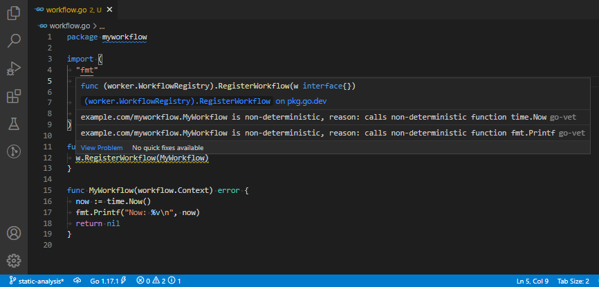

# Temporal Workflow Check

Temporal Workflow Check is a tool that statically analyzes
[Temporal Go workflows](https://docs.temporal.io/docs/go/workflows/) (i.e. functions passed to
`worker.RegisterWorkflow`) to check for non-deterministic code either directly in the function or in a function called
by the workflow. It is highly optimized to scan large codebases quickly.

**NOTE: This will not catch all cases of non-determinism such as global var mutation. This is just a helper and
developers should still scrutinize workflow code for other non-determinisms.**

## Installing

Build like a normal Go app. With this repository cloned and [Go](https://golang.org/) installed and on the `PATH`, run:

To install with [Go](https://golang.org/) installed and on the `PATH`, run:

    go install go.temporal.io/sdk/contrib/tools/workflowcheck

Or you can simply build by running `go build` inside of this directory. 

## CLI Usage

The executable has arguments in the form:

    workflowcheck [-flag] [package]

To simply check all source, navigate to the root of the repository/module to check and, with `workflowcheck` on
the `PATH`, run:

    workflowcheck ./...

For each workflow passed to `RegisterWorkflow` that is considered non-deterministic, this will output the reasons why.
There is no output if all workflows are properly deterministic.

The output is hierarchical if the reason occurs in code that the workflow calls. For example, if a workflow X calls Y
which calls Z that iterates over a map, the result will show X calling Y calling Z and why Z itself was
non-deterministic. This helps for debugging and disabling false positives.

Note, the source must be valid and compilable Go source for the tool to work. The package arguments are the same as any
other `go` tool. Run `workflowcheck -help` for more details on arguments. See "Configuration" below on how to configure
the checker.

### Example

Given the following file called `workflow.go` at the root of the `example.com/myworkflow` module:

```go
package myworkflow

import (
	"fmt"
	"time"

	"go.temporal.io/sdk/worker"
	"go.temporal.io/sdk/workflow"
)

func Register(w worker.WorkflowRegistry) {
	w.RegisterWorkflow(MyWorkflow)
}

func MyWorkflow(workflow.Context) error {
	now := time.Now()
	fmt.Printf("Now: %v\n", now)
	return nil
}
```

If `workflowcheck .` is run, the following output will appear:

```
/path/to/workflow.go:12:2: example.com/myworkflow.MyWorkflow is non-deterministic, reason: calls non-deterministic function time.Now
  time.Now is non-deterministic, reason: declared non-deterministic
/path/to/workflow.go:12:2: example.com/myworkflow.MyWorkflow is non-deterministic, reason: calls non-deterministic function fmt.Printf
  fmt.Printf is non-deterministic, reason: accesses non-deterministic var os.Stdout
```

The `-show-pos` argument can be provided to see exactly where each offending call happens. If we wanted to allow
`fmt.Printf` to be used in all workflows, we could have the config `workflowcheck.config.yaml`:

```yaml
decls:
  fmt.Printf: false
```

Then running `workflowcheck -config workflowcheck.config.yaml .` Would not only show the `time.Now` error. See the
"Configuration" section below for more details on configuration.

If, say, we wanted that specific `time.Now` call to be allowed, we could add the `//workflowcheck:ignore` comment right
above or on the right-hand side of the line that calls it. Then the next `workflowcheck` call would no longer report it
as non-deterministic.

## `go vet` and VisualStudio Code Usage

This tool works well with `go vet`. If the same example for CLI above was instead run with:

    go vet -vettool /path/to/workflowcheck

The same output would appear. The benefit of using `go vet` is that output is cached and many IDEs already support it.

To add to Visual Studio Code, add the following to your settings:

```jsonc
  // If using Windows, be sure to escape backslashes
  "go.vetFlags": ["-vettool", "c:\\work\\tem\\static-analysis\\temporal-sdk-go\\contrib\\tools\\workflowcheck\\workflowcheck.exe"],
  // Diagnostics have to be disabled for "go vet" to run
  "go.languageServerExperimentalFeatures": {
    "diagnostics": false
  }
```

Now, the next time you make a change and save, you will get the warnings:



These also appear in the problem view. There are a couple of things to be aware of.

One problem with this approach is that, as of this writing, language server diagnostics have to be disabled to even have
`go vet` run (see
[settings](https://github.com/golang/vscode-go/blob/master/docs/settings.md#golanguageserverexperimentalfeatures)).
Therefore you may want to work in a separate workspace for this for the time being if you want those dianostics for
other uses.

Another problem is that the extension running `go vet` only uses the first line of each output. This means the hierarchy
of why something is considered non-deterministic is swallowed. To see the full hierarchy, add the `-single-line` flag to
`go.vetFlags`. This will use `->` instead of newlines to represent the hierarchy.

## Determinism Rules

This tool uses a default set of non-deterministic functions/vars and an overridden set of functions/vars that are
force-set as deterministic. As of this writing, the qualified set of functions and variables that are considered
non-deterministic are:

* `crypto/rand.Reader` - Using the global crypto random reader is non-deterministic
* `math/rand.globalRand` - Using global pseudorandom is non-deterministic
* `os.Stderr` - Accessing the stderr writer is considered non-deterministic
* `os.Stdin` - Accessing the stdin reader is considered non-deterministic
* `os.Stdout` - Accessing the stdout writer is considered non-deterministic
* `time.Now` - Obtaining the current time is non-deterministic
* `time.Sleep` - Sleeping is non-deterministic

In addition to those functions/vars, the following Go source constructs are considered non-deterministic:

* Starting a goroutine
* Receiving from a channel
* Sending to a channel
* Iterating over a channel via `range`
* Iterating over a map via `range`

Many constructs that are known to be non-deterministic, such as mutating a global variable, are not able to be reliably
distinguished from deterministic use in common cases. This tool intentionally does not flag them.

In some cases, functions that are considered non-deterministic are commonly used in ways that only follow a
deterministic code path. For example if a common library function iterates over a map in a rare case that does not apply
to the situation, it will be flagged as non-deterministic. A few common cases of this have been force-set as
deterministic for common use:

* `(reflect.Value).Interface` - Was considered non-deterministic because deep down in Go internal source, this uses
  `sync.Map` (that does map iteration) as a cache of method layouts
* `runtime.Caller` - Was considered non-deterministic because deep down in Go internal source, some `runtime` source
  starts a goroutine on lazy GC start when building CGo frames
* `go.temporal.io/sdk/internal.propagateCancel` - Was considered non-deterministic because it starts a goroutine
* `(*go.temporal.io/sdk/internal.cancelCtx).cancel` - Was considered non-deterministic because it iterates over a
  map

## Configuration

A YAML configuration file can be provided via the `-config` flag. Here is an example config with details on what can be
set:

```yaml
# Overrides whether a function or variable is considered deterministic. The key
# is one of:
#
#   /path/to/package.Function
#   /path/to/package.Var
#   (/path/to/package.Receiver).Function
#   (*/path/to/package.Receiver).Function
#
# The value is true to be considered non-deterministic or false to be considered
# deterministic.
decls:
  github.com/google/uuid.rander: true

# Set of regexes for files to skip (matched after filepath.ToSlash applied)
skip:
  - 'some/package/[^/]*\.go'
```

For example, say this function was called from a workflow:

```go
func MetricSum(metrics map[string]*Metric) (count int) {
  for _, metric := range metrics {
    count += metric.Value
  }
  return
}
```

Running `workflowcheck ./...` might give a result like:

    /path/to/worker/main.go:29:2: path/to/package.MyWorkflow is non-deterministic, reason: calls non-deterministic function path/to/package.MetricSum
      path/to/package.MetricSum is non-deterministic, reason: iterates over map

However, reading the function it does not suffer from the non-determinism inherent in map iteration so a configuration
can be added to skip that function. Given a configuration at `workflowcheck.config.yaml` with:

```yaml
decls:
  path/to/package.MetricSum: false
```

It can be passed to the command:

    workflowcheck -config workflowcheck.config.yaml ./...

Now anytime `MetricSum` is called in a workflow, it is considered deterministic and will not be flagged.

## Inline Ignoring

If a reported non-determinism is a false positive, it can be ignored with `//workflowcheck:ignore`. This can be applied
as a comment at the end of the offending line:

```go
fmt.Println() //workflowcheck:ignore
```

Or above the offending line:

```go
//workflowcheck:ignore
fmt.Println()
```

Or above the offending block:

```go
//workflowcheck:ignore
for _, line := range lines {
  fmt.Println(line)
}
```

```go
//workflowcheck:ignore
func DoDangerousThing() {
  fmt.Println()
}
```

Note the lack of space between `//` and `workflowcheck:ignore`. Otherwise it will be treated as Godoc and not apply.
